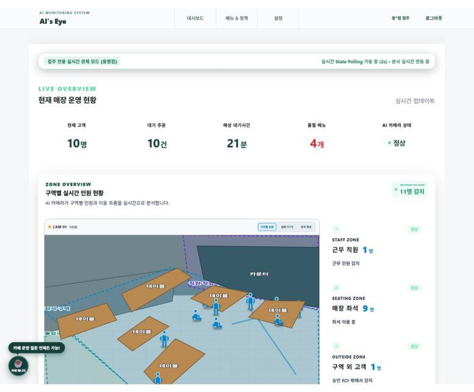
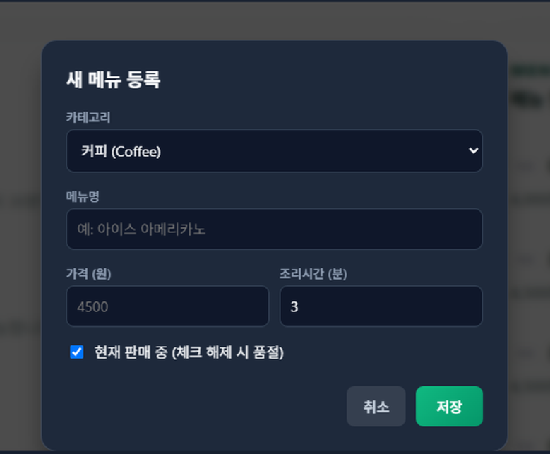
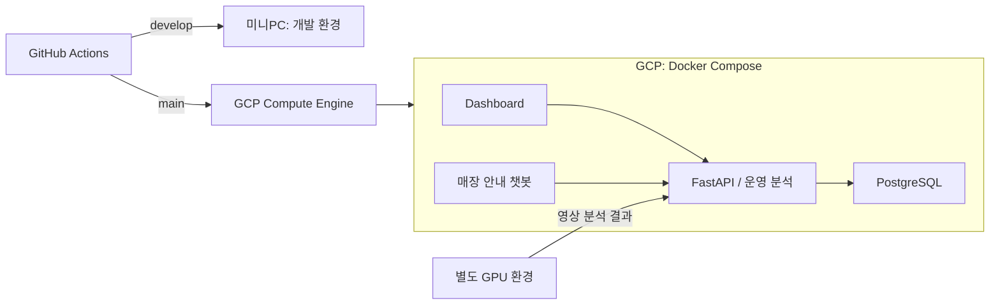

# AI’s EYE

매장 영상 분석 결과와 주문 데이터를 한곳에서 살펴보고, 직원 수를 바꿨을 때의 운영안을 비교하는 서비스입니다.

5인 팀에서 팀장을 맡았습니다. 제가 주로 작업한 부분은 공통 API·DB, 운영 분석 기능, 미니PC·GCP 배포입니다. 팀원들이 만든 영상 분석·대시보드·챗봇을 하나의 서비스로 연결하는 일도 함께 맡았습니다.

2026.06.29~08.28 · KT AIVLE 빅프로젝트

**KT AIVLE Big Project Collaboration 수상 · 2026.09.03**

## 서비스 화면

점주가 매장 인원, 대기 주문, 품절 메뉴를 함께 살펴보는 화면입니다.
프로젝트 당시 시연으로, 주문에는 합성 데이터를, 영상 분석에는 사전 분석 결과의 재생을 사용했습니다.

## 제가 맡은 개발과 배포

- **백엔드:** FastAPI와 PostgreSQL로 매장 상태·주문 데이터를 저장·조회하는 API를 만들고, 메뉴·정책 관리와 서비스 간 데이터 형식·인증을 정리했습니다. [DB 구성](https://github.com/aivle-b-t24/ai-s-eye/pull/34) · [기능 통합](https://github.com/aivle-b-t24/ai-s-eye/pull/113)
- **운영 분석:** Gemini Agent와 SimPy를 연결했습니다. 같은 주문 수요에서 직원 수를 바꿔 비교하고, 계산 결과가 목표를 충족하는지는 서버에서 판단하도록 구현했습니다. [관련 PR](https://github.com/aivle-b-t24/ai-s-eye/pull/273)
- **자동 배포:** develop은 공용 개발 서버인 미니PC에, main은 시연용 GCP에 배포하도록 GitHub Actions를 구성했습니다. [배포 PR](https://github.com/aivle-b-t24/ai-s-eye/pull/257)

메뉴 관리 화면과 운영 분석 실행 결과 보기

메뉴 가격·조리 시간·품절 여부를 변경하고 공통 API에 저장하는 화면입니다.

Gemini의 도구 호출과 SimPy의 계산 결과를 함께 보여줍니다.
**합성 주문을 사용한 시뮬레이션**이며 실제 매장의 개선 실적은 아닙니다.

## 배포 구조

영상 추론은 별도 GPU 환경에서 수행하고, GCP CPU VM에서는 웹·API·DB·운영 분석을 실행했습니다.

## 재배포 중 컨테이너가 뜨지 않았던 문제

미니PC 자동 배포에서 기존 컨테이너 이름과 충돌해 앱이 Created 상태에 멈추고 헬스체크가 실패했습니다.
앱 컨테이너만 선택해 교체하도록 스크립트를 수정하고, PostgreSQL과 데이터 볼륨은 교체 대상에서 제외했습니다.

수동 복구 후 자동 배포를 다시 실행해 정상 동작을 확인했고, 같은 처리를 GCP 배포에도 적용했습니다.
GCP 배포 스크립트에는 DB 백업과 배포 후 API·화면 응답 확인을 넣었습니다. 실패했을 때 원인을 찾을 수 있도록 컨테이너 상태와 로그도 출력합니다.

[수정 PR](https://github.com/aivle-b-t24/ai-s-eye/pull/259) · [배포 스크립트](scripts/deploy-gcp.sh) · [GCP 배포 실행](https://github.com/aivle-b-t24/ai-s-eye/actions/runs/31553126057)

## 실행과 문서

- [서비스 접속](https://aiseye.ldhcloud.com) · [화면 자료 출처](docs/media/README.md)
- [실행 안내](docs/portfolio-guide.md) · [GCP 운영 절차](docs/gcp-runbook.md) · [미니PC 운영 절차](docs/minipc-runbook.md)
- [원본 팀 저장소](https://github.com/aivle-b-t24/ai-s-eye)
