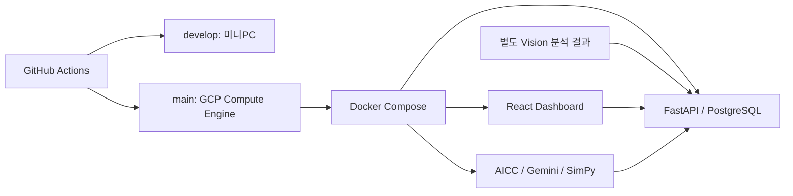

# AI’s EYE — AI 서비스 개발과 GCP 배포

매장 영상 분석 결과와 주문 데이터를 연결해 운영 상황과 인력 조건을 비교하는 서비스입니다.
**5인 팀장으로 API·DB·운영 분석을 구현하고, 미니PC·GCP 배포와 기능 통합을 담당했습니다.**

| 기간 | 역할 | 수상 |
|---|---|---|
| 2026.06.29~08.28 | 5인 팀 · 팀장 / Backend·Cloud·통합 | KT AIVLE Big Project Collaboration · 2026.09.03 |

## 내가 맡은 일

| 핵심 기여 | 구현 내용 | 근거 |
|---|---|---|
| GCP 자동 배포 | Docker Compose, develop→미니PC / main→GCP, 배포 후 응답 점검 | [PR #257](https://github.com/aivle-b-t24/ai-s-eye/pull/257) · [GCP 배포 코드](scripts/deploy-gcp.sh) |
| 공통 API·DB·통합 | FastAPI·PostgreSQL 데이터 저장, 인증, 팀 기능 연결 | [DB PR #34](https://github.com/aivle-b-t24/ai-s-eye/pull/34) · [통합 PR #113](https://github.com/aivle-b-t24/ai-s-eye/pull/113) |
| AI 운영 분석 | Gemini Agent와 SimPy를 연결해 같은 수요에서 인력 조건 비교 | [PR #273](https://github.com/aivle-b-t24/ai-s-eye/pull/273) |

Vision 기본 추론과 초기 Dashboard·AICC는 팀원 구현이며, 공통 API·배포 환경에 통합하고 개선했습니다.

## 결과와 문제 해결

- 미니PC 공용 개발 환경과 GCP 시연 환경을 연결하고, **2026.08.12 GCP 자동 배포 성공 기록**을 확보했습니다.
- 팀 기능을 하나의 서비스로 통합해 시연하고, KT AIVLE Big Project Collaboration을 수상했습니다.

**재배포의 컨테이너 충돌과 데이터 보존**

미니PC 재배포 과정에서 기존 컨테이너 이름이 충돌했습니다.
교체할 앱 컨테이너만 정리하고 DB·볼륨은 보존하도록 수정한 뒤 GCP 배포에도 적용했습니다.
DB 백업, 변경 후 응답 확인, 실패 시 로그 출력을 배포 절차에 포함했습니다.

[배포 스크립트](scripts/deploy-gcp.sh) · [GCP 운영 절차](docs/gcp-runbook.md)

## 구조와 실행 화면

GCP CPU VM은 웹·API·DB·운영 분석을 담당합니다. GPU 영상 추론은 별도 환경에서 수행합니다.

**운영 Agent와 인력 조건 비교 화면**

화면의 수치는 **합성 주문 기반 What-if 결과**입니다. 실제 매장의 개선 실적이 아닙니다.

## 더 보기

- [서비스 화면](https://aiseye.ldhcloud.com) — 2026.09.20 HTTP 응답 확인; 기능 이용에는 인증이 필요할 수 있습니다.
- [실행·설계 문서 안내](docs/portfolio-guide.md)
- [GCP 운영 절차](docs/gcp-runbook.md) · [미니PC 운영 절차](docs/minipc-runbook.md)
- [팀 저장소](https://github.com/aivle-b-t24/ai-s-eye)

이 저장소는 팀 프로젝트의 개인 포트폴리오용 포크입니다. 팀원의 기여와 원본 이력을 보존합니다.
