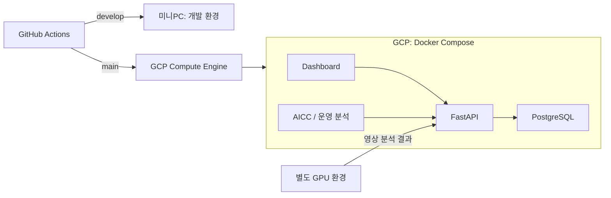

# AI’s EYE

매장 영상 분석 결과와 주문 데이터를 모아, 매장 상황을 확인하고 인력 운영안을 비교하는 서비스입니다.
5인 팀에서 팀장을 맡았습니다. 공통 API와 DB, 운영 분석 기능을 만들고, 팀원이 개발한 영상 분석·화면·챗봇을 연결했습니다. 미니PC와 GCP 배포도 담당했습니다.

2026.06.29~08.28 · KT AIVLE 빅프로젝트

**KT AIVLE Big Project Collaboration 수상 · 2026.09.03**

## 개발과 배포

- **백엔드:** FastAPI와 PostgreSQL로 매장 상태·주문 데이터를 저장하고 조회하는 API를 만들었습니다. 팀 기능을 연결할 때 사용할 데이터 형식과 인증도 정리했습니다. [DB 구성](https://github.com/aivle-b-t24/ai-s-eye/pull/34) · [기능 통합](https://github.com/aivle-b-t24/ai-s-eye/pull/113)
- **운영 분석:** Gemini Agent와 SimPy를 연결했습니다. 같은 주문 수요에서 직원 수를 바꿔 비교하고, 계산 결과가 목표를 충족하는지는 서버에서 판단하도록 구현했습니다. [관련 PR](https://github.com/aivle-b-t24/ai-s-eye/pull/273)
- **자동 배포:** `develop`은 공용 개발 서버인 미니PC에, `main`은 시연용 GCP에 배포하도록 GitHub Actions를 구성했습니다. [배포 PR](https://github.com/aivle-b-t24/ai-s-eye/pull/257)

영상 추론은 별도 GPU 환경에서 수행하고, GCP CPU VM에서는 웹·API·DB·운영 분석을 실행했습니다.

## 재배포 중 컨테이너가 뜨지 않았던 문제

미니PC 자동 배포에서 기존 컨테이너 이름과 충돌해 앱이 `Created` 상태에 멈추고 헬스체크가 실패했습니다.
앱 컨테이너만 선택해 교체하도록 배포 스크립트를 수정했습니다. PostgreSQL과 데이터 볼륨은 교체 대상에서 제외했습니다.

수동 복구 후 자동 배포를 다시 실행해 정상 동작을 확인했고, 같은 처리를 GCP 배포에도 적용했습니다.
GCP에서는 배포 전에 DB를 백업하고, 배포 후 API·화면의 응답을 확인하도록 구성했습니다. 실패하면 컨테이너 상태와 로그를 출력하게 했습니다.

[수정 PR](https://github.com/aivle-b-t24/ai-s-eye/pull/259) · [배포 스크립트](scripts/deploy-gcp.sh) · [GCP 배포 실행](https://github.com/aivle-b-t24/ai-s-eye/actions/runs/31553126057)

## 운영 분석 화면

직원 수를 바꿨을 때 대기시간과 완료 주문 수가 어떻게 달라지는지 비교하는 화면입니다.
아래 결과는 **합성 주문을 사용한 시뮬레이션**입니다.

## 실행과 문서

- [서비스 화면](https://aiseye.ldhcloud.com)
- [실행 안내](docs/portfolio-guide.md) · [GCP 운영 절차](docs/gcp-runbook.md) · [미니PC 운영 절차](docs/minipc-runbook.md)
- [원본 팀 저장소](https://github.com/aivle-b-t24/ai-s-eye)
